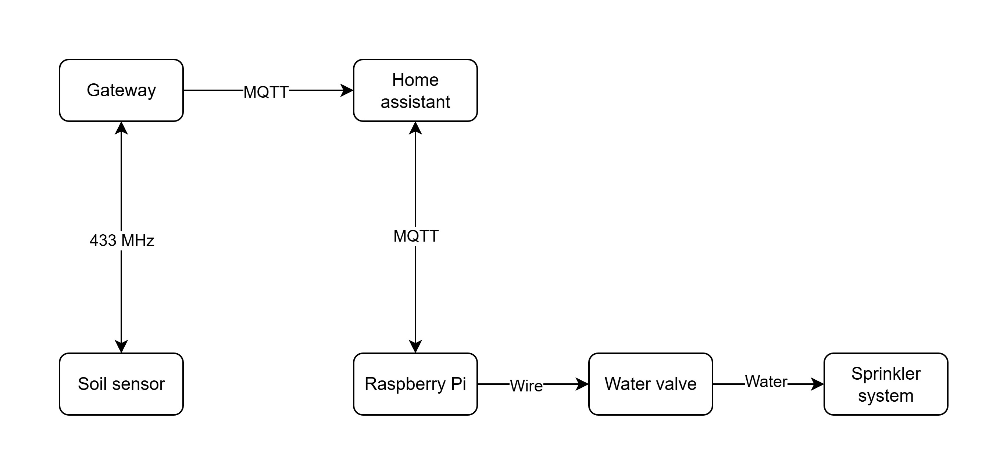
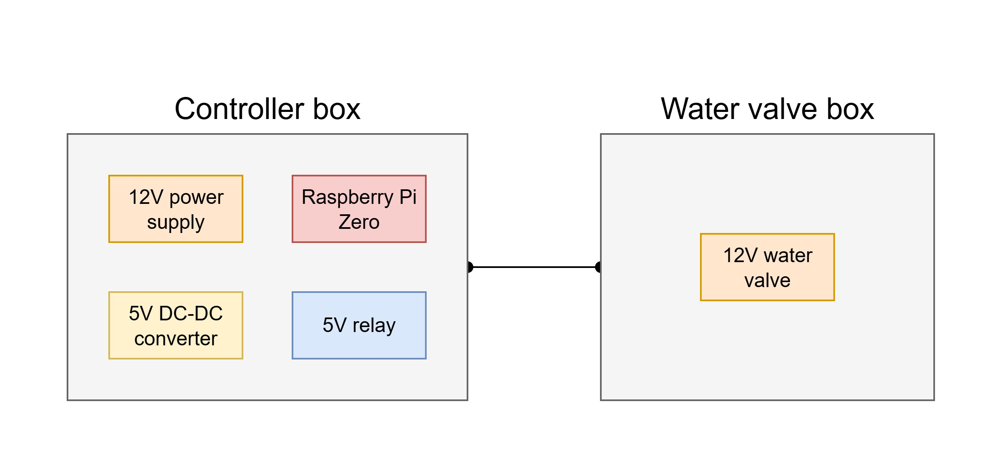
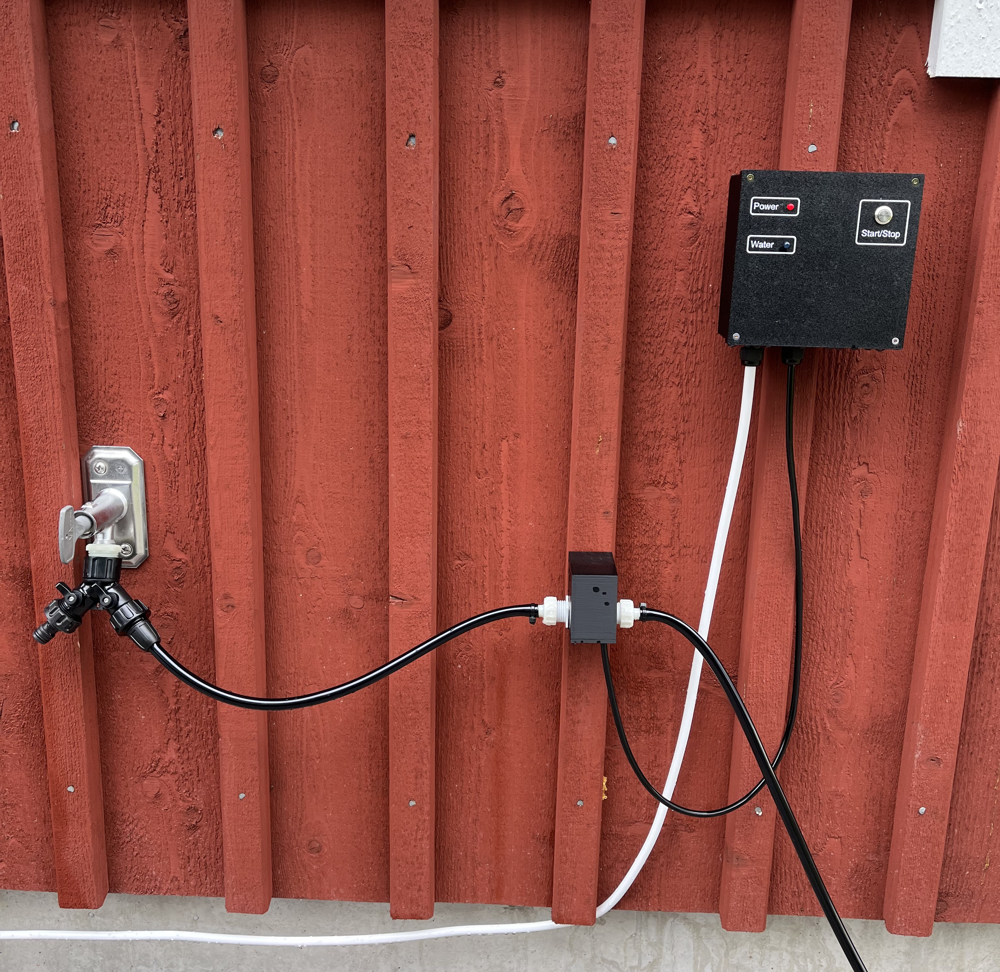
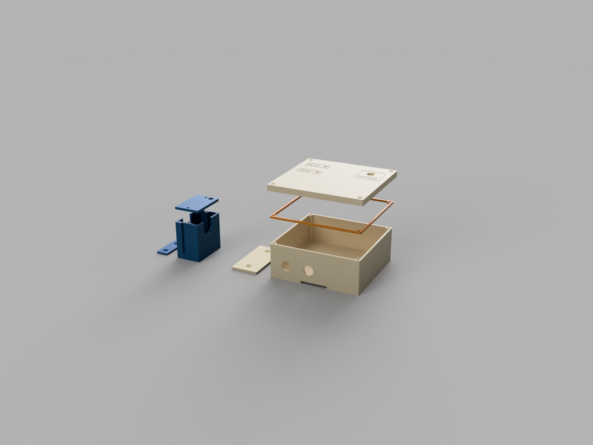

# Irrigation System Water Controller (work in progress)

Raspberry Pi-based water controller for an automated irrigation system. It utilizes data from soil moisture sensors to control a water valve, which is connected to a sprinkler system. The system can be controlled via a local Home Assistant dashboard and the use of MQTT.

[Get started! 🛁](#get-started)

## Features

The features that have been added so far are listed below. A more detailed coverage of each feature is given further down.

-   **Automatic valve control:** Opens the valve when soil moisture drops below a configurable threshold.
-   **Manual mode:** Allows manual control of the valve via home assistant or a physical button.
-   **MQTT integration:** Receives sensor data and control commands, publishes valve state and heartbeat.
-   **Heartbeat:** Periodically publishes a heartbeat message to indicate that the controller is online.
-   **Manually toggling water valve:** Possibility to togle the water valve on/off with the use of the home assistan dashboard, or via the physical button on the controller box.
-   **Configurable valve open time:** Set duration in minutes and seconds for water valve to remain open via dashboard in home assistant.

## System overview

The irrigation system consists of utilizing the moisture level from a soil sensor to decide if it should activate the water valve. When and for how long it should activate the valve depends on inputs that are configurable in the home assistant dashboard. To give a rough overview of the system we can take a look at image 1. Here we can see that a soil sensor is sending readings to a gateway, which passes them onwards to the Home Assistant server via MQTT. Whenever there is a change in the moisture level, or an input has been made in the Home Assistant dashboard, a MQTT message will be sent to the Raspberry Pi. Depending on set requirements the Raspberry Pi will either turn on or off the water valve.

**Image 1:** Depiction of the irrigation system.

### The physical components

Taking a look at the physical components of the irrigation system (image 2) reveals two separate boxes, the controller box and the valve box. The controller box has four separate parts:

1. 12V power supply that supplies power to the Raspberry Pi and the 12V water valve.
2. Raspberry Pi Zero board that controls the power to the water valve and also fetches data from Home Assistant via MQTT.
3. A DC-DC converter that inputs the 12V from the power supply and outputs 5V, which the Raspberry Pi uses.
4. 5V relay to switch on/off the power to the water valve.

Besides these four components the controller box also has two 5mm LEDs and one push button, for simple information displaying and manually starting the valve. The water valve box only contains the water valve.

**Image 2:** Depiction of the controller and water valve box.

 

We can take a look at how these two boxes look in practice, shown in image 3. A power cable is connected to the controller box which supplies the main power. Also, between the two boxes runs a power cable to power the water valve. To better shield the power cables between the two boxes a piece of plastic tubing (mainly used for the sprinkler system).

**Image 3:** Depiction of the controller and water valve box mounted on a wall and connected to a water source.

 

Image 4 shows the various parts that the controller and water valve box consists of. The controller box also has a belonging TPU-95 sealent, which can be used to improve protection from moisture.

**Image 4:** Depiction of the water valve and controller box and their respective parts.

### Home Assistant + MQTT

**TBD**

# Get started

To get started with this project we'll start with listing the hardware needed, followed by setting up the software.

## Hardware

There are various options available when it comes to hardware. For each listed piece we'll try to share a link to a product that can be used, but feel free to utilize any other product which fulfills the requirements. The dimensions for the inside of the controller box can be found [here](assets/images/dimensions_controller_box_top.jpg), the dimensions for the cable glands can be found [here](assets/images/dimensions_controller_box_front.jpg).

-   Raspberry Pi Zero W [amazon.com](https://www.amazon.com/Raspberry-Zero-Bluetooth-RPi-2W/dp/B09LH5SBPS)
    > [!NOTE]
    > other boards should also work great, but there can be limitations in fitting it in the controller box.
-   5V relay [amazon.com](https://www.amazon.com/AEDIKO-Channel-Optocoupler-Isolation-Support/dp/B095YD3732)
-   Two 5mm LEDs [amazon.com](https://www.amazon.com/MCIGICM-Circuit-Assorted-Science-Experiment/dp/B07PG84V17)
-   Water resistant push button [amazon.com](https://www.amazon.com/Gebildet-Prewired-Waterproof-Self-Locking-Stainless/dp/B0BXPFW69R)
-   Soil moisture sensor (+ gateway to MQTT server)
    > [!NOTED]
    > The choice of soil moisture sensor is quite flexible, but what this project is utilizing is one which can upload the readings to a MQTT server. One of
-   12V switching power supply [amazon.com](https://www.amazon.com/LRS-50-5-Switching-Supply-Single-Output/dp/B019GYOCMM)
-   Cable gland, PG9 [amazon.com](https://www.amazon.com/Gebildet-Waterproof-Adjustable-Connector-Protector/dp/B07VT317NT)

## Software

### Pin Configuration

| Function | GPIO Pin |
| -------- | -------- |
| Valve    | 17       |
| LED      | 27       |
| Button   | 22       |

### MQTT Topics

-   `garden/moisture_level` (integer): Current soil moisture value
-   `garden/moisture_threshold` (integer): Threshold to trigger watering
-   `garden/manual_mode` (bool): Enable/disable manual mode (`true`/`false`)
-   `garden/valve_open_time_m` (integer): Valve open time in minutes
-   `garden/valve_open_time_s` (integer): Valve open time in seconds
-   `garden/valve_state` (string): Published valve state (`on`/`off`)
-   `garden/controller/heartbeat` (string): Publish heartbeat (`online`)

### Usage

**TBD**

## License

[Apache licence V2](https://www.apache.org/licenses/LICENSE-2.0)
